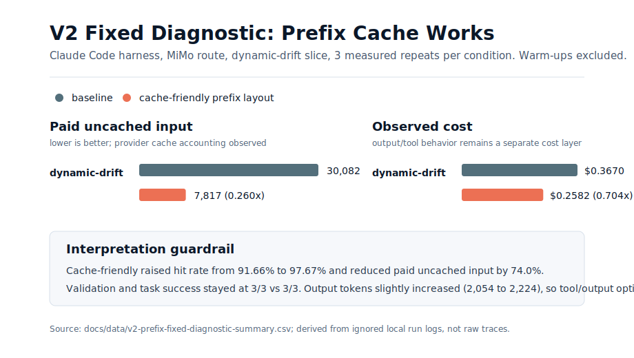

# Make Agents Cheaper

A Rust CLI and research toolkit for **agent token-cost optimization**.

The current focus is a Token Saver for coding agents: improve prompt-cache reuse
at the harness layer, reduce paid uncached input, and keep task success
measurable.

Phase 1 is Codex-first. The longer-term goal is to make the same cache-hit discipline useful for Claude Code, Cursor, custom agent runners, and multi-agent routers.

The idea is simple:

> Do not remove context. Make repeated context cacheable.

In one sentence:

> Make long-horizon coding agents cheaper by optimizing prompt-cache reuse outside the model.

## What It Does

- Audits local Codex config for cache-friendly provider, transport, session, and model settings.
- Fingerprints prompt layers and tool schemas without printing private prompt text.
- Normalizes Claude Code direct JSON or optional `claude-trace` logs into comparable JSONL.
- Compares baseline vs cache-friendly runs with quality gates, per-slice tables, and paper-facing reports.
- Generates reproducible pilot plans and bounded pilot runner scripts.

This is a harness-level counterpart to model-side efficiency work: model providers make token processing cheaper; this project tries to make repeated agent context cheaper to reuse. More background is in `docs/project-positioning.md`.

## Product Map And Experimental Object

There are three related layers, but they should not be mixed:

- `make-agents-cheaper`: the Rust audit/eval tool. This is the experiment and measurement engine. It fingerprints prompt layers, checks tool schema stability, analyzes cache breakpoints, records token usage, and compares baseline vs cache-friendly runs.
- `make-agents-cheaper-skill`: the reusable skill packaging layer. A skill turns the method into instructions and runbooks that another agent can apply, but the skill itself is not the primary measurement instrument.
- `cheapcode` or a future cheaper agent: a possible full agent harness that would own prompt assembly, tools, memory, and routing directly. This is a later product direction, not the current experimental object.

In current experiments, Codex is the development environment used to build the tooling and write the reports. The studied harness is Claude Code, and the backend model/provider in the current setup is MiMo, such as `mimo-v2.5-pro`. The paper should therefore describe the object of study as a Claude Code harness running on a MiMo-compatible model route, with `make-agents-cheaper` used as the audit/eval instrumentation.

So yes: experiments use the audit/eval layer, not the skill layer, as evidence. The skill layer is for reuse and deployment of the same cache-friendly discipline after the method has been made explicit and measurable.

## Why This Can Be Cheap

Coding agents are expensive in long sessions because every turn can resend a large repeated prefix:

- system and developer instructions
- tool definitions and JSON schemas
- repo rules such as `AGENTS.md`
- stable project context
- previous session and conversation identifiers

Prompt caching can make that repeated prefix cheaper, but only when the provider sees the same beginning of the request again. The cache is strict: similar text is not enough; the prefix has to stay stable enough to match.

`make-agents-cheaper` helps with the parts a user can control:

- **Stable provider:** do not bounce the same task between providers or upstream keys.
- **Stable transport:** prefer one agent path for the task, especially Responses API for Codex.
- **Stable session:** WebSocket mode and session-aware routing make it easier for later turns to land near existing cache.
- **Stable model settings:** model and reasoning effort changes can create different request buckets.
- **Stable static context:** keep repeated rules and tool context stable; avoid injecting changing bridge text before it.

The savings come from the provider charging or processing cached input more cheaply than uncached input. This project does not hide context from the agent, truncate important instructions, or rewrite the model's task. It makes the official cache path easier to hit.

The rough mental model is:

```text
same long prefix + same session route + compatible transport
  -> higher prompt-cache hit probability
  -> less repeated prefill work
  -> lower repeated-input cost and latency
```

In other words:

```text
It reduces paid uncached input, not necessarily total input.
```

## Prefix-Cache Evidence Snapshot

The fixed V2 dynamic-drift diagnostic now supports the narrow prefix-cache claim: moving dynamic harness state later reduced paid uncached input while preserving task success.



Summary:

- Cache hit rate improved from 91.66% to 97.67%.
- Paid uncached input fell from 30,082 to 7,817 tokens (0.260x).
- Observed cost fell from $0.366976 to $0.258237 (0.704x).
- Validation and task success stayed at 3/3 vs 3/3.
- Output tokens increased slightly, from 2,054 to 2,224, so tool-output optimization remains a separate future layer.

The earlier V2 mixed/negative pilot is retained as a regression case. Diagnosis found a behavioral outlier plus fixture Git-isolation leakage; after fixing absolute prompt paths and fixture-local Git state, the bounded 3-repeat diagnostic returned to the expected direction. This is an incremental prefix optimization: it reduces repeated paid input, but it does not guarantee that tool calls, output verbosity, or agent trajectory will become cheaper.

See `docs/v2-prefix-fixed-diagnostic.md`, `docs/v2-regression-diagnosis.md`, and `docs/data/v2-prefix-fixed-diagnostic-summary.csv` for the derived, commit-safe data. Raw run logs stay ignored under `runs/`.

## Feature 1: Codex Cache-Hit Audit

Cache-aware routers can improve cache hits in the routing layer. This repository focuses on the missing client-side step:

> Before blaming the router or model, verify that your local Codex config is actually cache-hit friendly.

The bundled Rust CLI is read-only by default. It inspects a Codex `config.toml` and reports:

- whether the configured provider has a stable `base_url`
- whether `wire_api = "responses"` is set
- whether WebSocket mode is enabled when you expect long sessions
- whether `env_key` is configured and present in the current shell
- whether model and reasoning settings are stable enough for repeat sessions
- whether the config looks likely to drift between providers or transport modes

It also prints HTTP and WebSocket configuration templates with placeholder router settings. Set `MAKE_AGENTS_CHEAPER_EXPECTED_BASE_URL` when you want the audit to verify a private endpoint without putting that endpoint in source control.

## Quick Start

### Install Or Run Locally

Prerequisites:

- Rust toolchain with `cargo`.
- Optional for paper builds: `latexmk`, `pdflatex`, `bibtex`, `pdfinfo`, and `pdffonts`.
- Optional for Claude Code experiments: `claude` CLI.

On macOS, the CLI path is the same as Linux:

```bash
git clone https://github.com/3873225350/make-agents-cheaper.git
cd make-agents-cheaper
cargo test
cargo run --quiet -- --help
```

To install the binary from a local checkout:

```bash
cargo install --path .
make-agents-cheaper --help
```

Or install directly from GitHub:

```bash
cargo install --git https://github.com/3873225350/make-agents-cheaper.git
make-agents-cheaper --help
```

macOS release binaries and a Homebrew formula template are tracked for tagged releases; see `docs/release.md`.

### Workflow 1: Audit Codex Config

Ask Codex:

```text
Use $make-agents-cheaper to inspect my Codex config and tell me whether it is prompt-cache friendly.
```

Or run the CLI directly:

```bash
cargo run --quiet
```

Run explicit Codex config audit:

```bash
cargo run --quiet -- audit --config ~/.codex/config.toml
```

Print the recommended WebSocket template:

```bash
cargo run --quiet -- --print-ws-config
```

Print the simpler HTTP template:

```bash
cargo run --quiet -- --print-http-config
```

Inspect a custom config path:

```bash
cargo run --quiet -- --config /path/to/config.toml
```

### Workflow 2: Compare Existing Run Logs

Try the bundled sanitized real example first:

```bash
cargo run --quiet -- eval \
  --baseline examples/baseline.jsonl \
  --candidate examples/cache-friendly.jsonl

cargo run --quiet -- task-report \
  --baseline examples/baseline.jsonl \
  --candidate examples/cache-friendly.jsonl
```

The default `examples/` pair is derived from a real Claude Code + MiMo paired-drift run with raw trace paths removed. A fixed V2 diagnostic pair is also available as `examples/v2-fixed-diagnostic-baseline.jsonl` and `examples/v2-fixed-diagnostic-cache-friendly.jsonl`. The earlier mixed/negative V2 pilot remains available as `examples/v2-mixed-baseline.jsonl` and `examples/v2-mixed-cache-friendly.jsonl` for regression analysis.

Then use the same commands on normalized benchmark records:

```bash
cargo run --quiet -- eval \
  --baseline runs/<experiment>/baseline.jsonl \
  --candidate runs/<experiment>/cache-friendly.jsonl

cargo run --quiet -- task-report \
  --baseline runs/<experiment>/baseline.jsonl \
  --candidate runs/<experiment>/cache-friendly.jsonl

cargo run --quiet -- analysis-report \
  --baseline runs/<experiment>/baseline.jsonl \
  --candidate runs/<experiment>/cache-friendly.jsonl \
  --output runs/<experiment>/analysis-report.md
```

Extract tool-claimed code changes from a session or tool-history JSONL without reading the current worktree:

```bash
cargo run --quiet -- evidence-diff \
  --input runs/<experiment>/raw/session.jsonl \
  --output runs/<experiment>/code-changes.json
```

Read the result conservatively:

- A win requires lower uncached input and no task-success regression.
- Warm-up calls should stay out of measured JSONL.
- If `cache_accounting_observable=false`, do not claim token-cost savings from that row.
- Lower output tokens or fewer total tokens are not the main claim.

### Workflow 3: Plan A Claude Code Pilot

Generate a reproducible experiment directory and a paired command plan from the V2 manifest:

```bash
cargo run --quiet -- init-experiment --dir runs/<date>-claude-mimo-real-coding-v2-pilot

cargo run --quiet -- pilot-plan \
  --manifest docs/task-suites/real-coding-ablation-v2.manifest.json \
  --task docs-token-accounting \
  --experiment-dir runs/<date>-claude-mimo-real-coding-v2-pilot \
  --slice dynamic-drift \
  --repeats 1
```

The generated plan prints the prompt file, warm-up calls, measured calls, validation logs, direct Claude JSON capture path, `claude-json-import`, `eval`, `task-report`, and `analysis-report` commands.

To generate a runnable script instead of only printing the plan:

```bash
cargo run --quiet -- run-pilot \
  --manifest docs/task-suites/real-coding-ablation-v2.manifest.json \
  --task docs-token-accounting \
  --experiment-dir runs/<date>-claude-mimo-real-coding-v2-pilot \
  --slice dynamic-drift \
  --repeats 1
```

By default, `run-pilot` only writes `runs/<experiment>/notes/run-pilot.sh`. Execute it manually with `bash`, or pass `--execute true` when you intentionally want the CLI to call Claude. Running it may incur model cost.

The V2 pilot manifest points at `runs/fixtures/real-coding-v2`, which is intentionally ignored as local experiment state. Fresh clones can use `examples/` immediately; Claude pilot execution requires creating or restoring that fixture first.

## Command Reference

These commands are the first executable pieces of the portable cache-hit layer for existing agents.

Fingerprint prompt or harness layers without printing private prompt text:

```bash
cargo run --quiet -- fingerprint --input layers.json
cargo run --quiet -- fingerprint --input current-layers.json --previous previous-layers.json
```

Inspect tool schema stability:

```bash
cargo run --quiet -- tool-schema --input tools.json
cargo run --quiet -- tool-schema --input current-tools.json --previous previous-tools.json
```

Inspect explicit `cache_control` breakpoint placement:

```bash
cargo run --quiet -- breakpoints --input request.json
```

Compare baseline and cache-friendly benchmark records:

```bash
cargo run --quiet -- eval --baseline baseline.jsonl --candidate cache-friendly.jsonl
```

Print per-task token usage:

```bash
cargo run --quiet -- task-report --baseline baseline.jsonl --candidate cache-friendly.jsonl
```

Write paper-facing Markdown tables and interpretation guardrails:

```bash
cargo run --quiet -- analysis-report \
  --baseline baseline.jsonl \
  --candidate cache-friendly.jsonl \
  --output runs/exp/analysis-report.md
```

Normalize direct Claude Code JSON output into the eval schema:

```bash
cargo run --quiet -- claude-json-import \
  --input runs/exp/raw/claude-json/run-1.json \
  --run-id run-1 \
  --task-id docs-token-accounting \
  --condition cache-friendly \
  --slice dynamic-drift \
  --repeat-id 1 \
  --phase measured \
  --output runs/exp/cache-friendly.jsonl \
  --validation-path runs/exp/validation/run-1.txt \
  --validation-passed true
```

Optional: if a raw `claude-trace` JSONL file exists, normalize it into the eval schema and request/layer/tool artifacts:

```bash
cargo run --quiet -- trace-import \
  --input runs/exp/raw/claude-trace/run-1.jsonl \
  --run-id run-1 \
  --task-id docs-token-accounting \
  --condition baseline \
  --slice dynamic-drift \
  --repeat-id 1 \
  --phase measured \
  --output runs/exp/baseline.jsonl \
  --artifacts-dir runs/exp \
  --validation-path runs/exp/validation/run-1.txt \
  --validation-passed true
```

The current roadmap uses direct Claude JSON as the default evidence path. It preserves usage/cost/validation accounting, but it cannot prove request-shape facts such as system/tool/message ordering.

Compare with provider prices, expressed as USD per million tokens:

```bash
cargo run --quiet -- eval \
  --baseline baseline.jsonl \
  --candidate cache-friendly.jsonl \
  --uncached-input-per-mtok <USD> \
  --cached-input-per-mtok <USD> \
  --output-per-mtok <USD>
```

Print a cache-aware compact / reactivation template:

```bash
cargo run --quiet -- compact-template
```

The expected JSONL benchmark record format is documented in `docs/evaluation-metrics.md`.

Initialize a reproducible experiment log directory:

```bash
cargo run --quiet -- init-experiment --dir runs/2026-05-09-claude-mimo-cache
```

Generate a paired pilot command plan from the V2 task manifest:

```bash
cargo run --quiet -- pilot-plan \
  --manifest docs/task-suites/real-coding-ablation-v2.manifest.json \
  --task docs-token-accounting \
  --experiment-dir runs/2026-05-09-claude-mimo-real-coding-v2-pilot \
  --slice dynamic-drift \
  --repeats 1
```

Generate the full task-matrix command plan:

```bash
cargo run --quiet -- matrix-plan \
  --manifest docs/task-suites/real-coding-ablation-v2.manifest.json \
  --experiment-dir runs/2026-05-09-claude-mimo-real-coding-v2-full \
  --repeats 3
```

Full protocol: `docs/evaluation-protocol.md`.

## Recommended Codex WebSocket Config

Use this when you want stronger long-session continuity:

```toml
model_provider = "cache_router"
model = "gpt-5.4"
model_reasoning_effort = "xhigh"
plan_mode_reasoning_effort = "xhigh"
model_reasoning_summary = "none"
model_verbosity = "medium"
approval_policy = "never"
sandbox_mode = "danger-full-access"
suppress_unstable_features_warning = true

[model_providers.cache_router]
name = "OpenAI"
base_url = "https://router.example/v1"
wire_api = "responses"
requires_openai_auth = false
env_key = "CACHE_ROUTER_API_KEY"
supports_websockets = true

[features]
responses_websockets_v2 = true
```

## Recommended Codex HTTP Config

Use this when you prefer a simpler, broadly compatible setup:

```toml
model_provider = "cache_router"
model = "gpt-5.4"
model_reasoning_effort = "xhigh"
plan_mode_reasoning_effort = "xhigh"
model_reasoning_summary = "none"
model_verbosity = "medium"
approval_policy = "never"
sandbox_mode = "danger-full-access"

[model_providers.cache_router]
name = "OpenAI"
base_url = "https://router.example/v1"
wire_api = "responses"
requires_openai_auth = false
env_key = "CACHE_ROUTER_API_KEY"
```

## Cheapness Checklist

- Keep static instructions, tool schemas, and repo rules stable.
- Avoid switching providers, models, or transport modes mid-task.
- Prefer Responses API for Codex-style workflows.
- Use WebSocket mode for long interactive sessions when available.
- Keep session and conversation continuity intact.
- Put dynamic task details after stable context when you control prompt layout.
- Do not chase artificial cache metrics by rewriting request semantics.

## What It Does Not Do

- It does not make every token cheap.
- It does not train or fine-tune a model.
- It does not cache model outputs or replay old answers.
- It does not share cache across organizations.
- It does not mutate `~/.codex/config.toml` unless a future command explicitly implements that and you ask for it.
- It does not print API keys.
- It does not claim support for every agent yet; Codex is the first supported target.

## Roadmap

- **Phase 1:** Codex config audit and cache-aware router-friendly templates.
- **Phase 2:** prefix fingerprinting, tool-schema drift checks, breakpoint analysis, benchmark comparison, and cache-aware compact templates.
- **Phase 3:** package reusable agent skills for Codex-first workflows, then Claude Code and Cursor cache-friendliness checks where reliable local signals exist.
- **Phase 4:** router and multi-agent workflow diagnostics.

## Technical Report And Evaluation

- LaTeX report: `paper/main.tex`
- Evaluation metric spec: `docs/evaluation-metrics.md`
- Full experiment protocol: `docs/evaluation-protocol.md`
- Paired ablation runbook: `docs/paired-ablation-runbook.md`
- Project positioning and origin: `docs/project-positioning.md`
- First task-suite dataset: `docs/task-suites/claude-cache-ablation-v1.md`
- Real coding-task suite: `docs/task-suites/real-coding-ablation-v1.md`
- Phenomena analysis log: `docs/phenomena-analysis.md`
- MiMo token accounting note: `docs/mimo-token-accounting.md`
- V2 fixed prefix diagnostic: `docs/v2-prefix-fixed-diagnostic.md`
- V2 direct-json regression snapshot: `docs/v2-direct-json-pilot.md`
- V2 regression diagnosis: `docs/v2-regression-diagnosis.md`
- RTK inspiration and next runtime layer: `docs/rtk-inspiration.md`
- Session/tool evidence diff: `docs/evidence-diff.md`
- Release and Homebrew plan: `docs/release.md`
- Long-term task plan: `taskplan/roadmap.md`

The evaluation goal is not to show fewer total tokens. It is to show:

```text
cached tokens go up
uncached paid input goes down
observed or estimated cost goes down when output/tool behavior is comparable
latency does not regress
task success does not regress
```

## Build

```bash
cargo build --release
```

The binary will be available at:

```bash
target/release/make-agents-cheaper
```

Run validation:

```bash
cargo test
```

## Install As A Skill

Ask Codex:

```text
Install the make-agents-cheaper skill from https://github.com/3873225350/make-agents-cheaper
```

Or clone/copy this folder into your Codex skills directory as `make-agents-cheaper`.

## Privacy And Safety

Report mode does not write files. It prints only configuration health and hides environment variable values. It never prints API keys.

If you share reports publicly, review local paths and provider names first.
