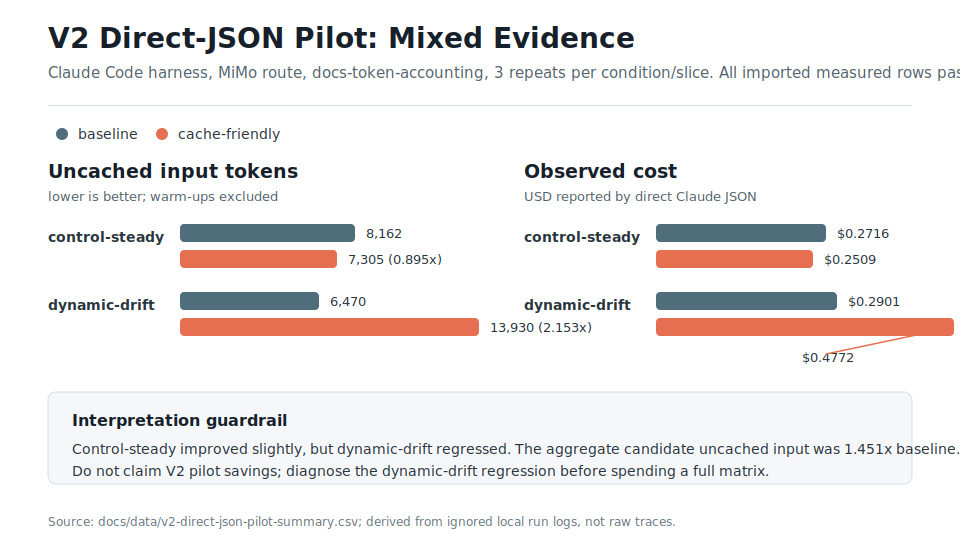

# V2 Direct-JSON Pilot Snapshot

This snapshot is a safe, derived summary of the local experiment:

```text
runs/2026-05-11-claude-mimo-direct-json-v2-pilot/
```

Raw run logs remain ignored under `runs/`. The tracked data here is limited to aggregate counters needed to explain the result.



| Slice | Condition | Records | Cache hit | Uncached input | Observed cost | Task success |
| --- | --- | ---: | ---: | ---: | ---: | ---: |
| `control-steady` | baseline | 3 | 97.79% | 8,162 | $0.271577 | 3/3 |
| `control-steady` | cache-friendly | 3 | 97.85% | 7,305 | $0.250883 | 3/3 |
| `dynamic-drift` | baseline | 3 | 98.39% | 6,470 | $0.290073 | 3/3 |
| `dynamic-drift` | cache-friendly | 3 | 97.88% | 13,930 | $0.477192 | 3/3 |

## Read This Conservatively

- The V2 pilot does not support the primary savings claim.
- `control-steady` improved slightly: cache-friendly uncached input was 0.895x baseline.
- `dynamic-drift` regressed: cache-friendly uncached input was 2.153x baseline.
- Aggregate cache-friendly uncached input was 1.451x baseline.
- Direct Claude JSON supports usage, cost, latency, validation, and task success, but it does not expose request-shape artifacts.
